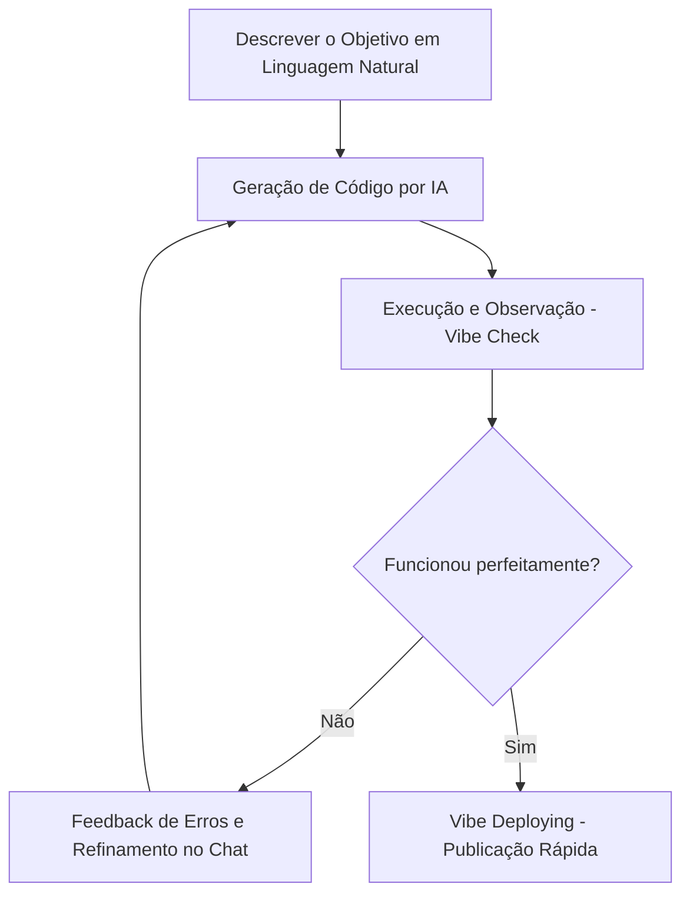

# 📘 Vibe Coding: O Guia Definitivo do Desenvolvimento via IA

Bem-vindo ao repositório do projeto **Vibe Coding: O Guia Definitivo do Desenvolvimento via IA**, desenvolvido como parte do desafio de projeto da **DIO (Digital Innovation One)** utilizando o **Gemini Notebook** (antigo NotebookLM).

Este repositório documenta um caderno temático completo que explora a revolução do desenvolvimento de software assistido por Inteligência Artificial, detalhando o novo papel do desenvolvedor, fluxos de trabalho modernos, riscos, salvaguardas e ferramentas essenciais em 2026.

---

## 🎯 1. Contexto e Objetivos

### Contexto
O desenvolvimento de software está passando por uma transição histórica de paradigmas. Com a evolução dos Modelos de Linguagem de Larga Escala (LLMs) e ferramentas agênticas de codificação, surge o conceito de **Vibe Coding**. O termo descreve um estado onde a mediação da intenção humana deixa de ser sintaxe rígida (código estruturado tradicional) para se tornar inferência probabilística (diálogo em linguagem natural e orquestração de IA).

### Objetivos de Estudo
- **Compreensão Conceitual**: Mapear a transição do papel do programador tradicional para o de um Diretor Técnico ou Curador de Código.
- **Domínio Metodológico**: Estudar e documentar os principais fluxos de trabalho (Workflow) e modelos de desenvolvimento (UAM, ICCM, PDM, etc.) no ecossistema agêntico.
- **Análise de Ferramentas**: Identificar as tecnologias líderes (Cursor, Windsurf, Claude Code, Bolt.new, v0).
- **Gerenciamento de Riscos**: Identificar e documentar as armadilhas do "Vibe Slop", vulnerabilidades de segurança e técnicas de mitigação.

---

## 📚 2. Curadoria de Fontes

Para alimentar o Gemini Notebook e consolidar as bases deste guia, foram curadas e analisadas as seguintes fontes abertas:

1. **Karpathy, Andrej (2025)**: *O Nascimento do Vibe Coding*. Postagem e discussão seminal do dia 2 de fevereiro de 2025 que introduziu e popularizou o termo na comunidade de tecnologia.
2. **Manuais Técnicos de Engenharia de Software Autônoma**: Documentações oficiais e guias de arquitetura das ferramentas Cursor (Composer Mode), Windsurf (Cascade Flow) e Claude Code.
3. **Estudos de Caso sobre Segurança de Código Gerado por IA**: Relatórios apontando os riscos de segurança (cerca de 45% do código gerado possui vulnerabilidades latentes) e bibliotecas alucinadas.
4. **Artigos de Paradigmas de Colaboração Humano-IA**: Estudos detalhando os modelos UAM (Unconstrained Automation), ICCM (Iterative Conversational Collaboration) e PDM (Planning-Driven Model).

---

## 🔬 3. Engenharia de Prompts e "Cicatrizes" (Troubleshooting)

### Estratégia de Prompts Utilizada
Para extrair resumos estruturados de qualidade a partir das fontes fornecidas no Gemini Notebook, foram testados os seguintes prompts estratégicos:

*   **Prompt de Exploração Inicial**:
    > *"A partir das fontes enviadas, explique detalhadamente o conceito de Vibe Coding e diferencie o papel do desenvolvedor tradicional daquele proposto por Andrej Karpathy."*
*   **Prompt de Consolidação de Riscos**:
    > *"Faça uma análise crítica das fontes focando exclusivamente em segurança e manutenabilidade de software. Quais são os riscos invisíveis do 'Vibe Slop'?"*
*   **Prompt de Mapeamento Técnico**:
    > *"Classifique em formato de tabela as principais ferramentas agênticas citadas nos textos e os modelos de colaboração (como UAM e PDM)."*

### 🩹 Cicatrizes do Aprendizado (Troubleshooting)
Durante o estudo e teste das ferramentas, identificamos desafios práticos importantes:
1.  **O Efeito Whack-a-Mole**: Em sessões puras de Vibe Coding, corrigir um bug apontado pela IA às vezes gerava outros quatro bugs por falta de consistência global da arquitetura. 
    *   *Solução*: Transicionar da abordagem caótica de chat para o modelo **Planning-Driven (PDM)**, criando e mantendo um arquivo `spec.md` ou `CLAUDE.md` atualizado para guiar a IA.
2.  **Bibliotecas Alucinadas**: A IA recomendava rotineiramente imports de pacotes fictícios ou obsoletos para resolver problemas rápidos.
    *   *Solução*: Criar um prompt de validação cruzada exigindo que a IA cite dependências conhecidas e estáveis antes de sugerir implementações.

---

## 📖 4. Miniguia de Estudo: O Paradigma do Vibe Coding

### 📂 Resumos Estruturados do Assunto

#### A. O Novo Papel do Desenvolvedor
No Vibe Coding, a responsabilidade do humano muda radicalmente. O desenvolvedor deixa de focar na sintaxe linha a linha (a matéria-prima) e passa a focar na **intenção** e no **design de sistema**. Ele se torna um Arquiteto/Curador, revisando o comportamento do software e garantindo que as regras de negócio sejam respeitadas.

#### B. O Ciclo de Trabalho (Workflow)
O ciclo básico de desenvolvimento divide-se em 5 etapas principais:


#### C. Os 5 Modelos de Desenvolvimento
1.  **UAM (Unconstrained Automation)**: Automação livre. Alta velocidade, baixa auditoria. Ideal para MVPs e estudos rápidos.
2.  **ICCM (Iterative Conversational Collaboration)**: Par de desenvolvimento iterativo. A IA sugere, o humano lê e valida cada linha antes de aceitar.
3.  **PDM (Planning-Driven Model)**: Desenvolvimento orientado a planejamento. O humano elabora especificações claras antes de a IA começar a codificar.
4.  **TDM (Test-Driven Model)**: O programador escreve os testes de integração e aceitação; a IA gera o código até passar em todos os testes.
5.  **CEM (Context-Enhanced Model)**: Foco total no enriquecimento do contexto com arquivos como `.cursorrules` ou `README` descritivos.

---

### 📚 Glossário de Termos-Chave

*   **Vibe Coding**: Prática de criar softwares inteiros por meio de diálogo em linguagem natural com IAs agênticas, sem focar ativamente na escrita de sintaxe tradicional.
*   **Vibe Check**: A validação intuitiva e prática do comportamento visual e lógico de uma aplicação, testando suas interações em vez de inspecionar detalhadamente o código-fonte gerado.
*   **Vibe Deploying**: A capacidade de publicar a aplicação gerada em ambiente de produção com um clique ou comando, reduzindo a fricção de infraestrutura.
*   **Vibe Slop**: O acúmulo de códigos frágeis, redundantes ou inseguros resultantes da geração contínua por IA sem supervisão de arquitetura humana.
*   **Agente Autônomo**: Uma entidade de IA capaz de planejar etapas de trabalho, rodar comandos em terminal, ler e gravar arquivos sem supervisão direta para cada ação.

---

### ⚙️ Prompts Reutilizáveis para Estudos Futuros

Você pode copiar os prompts abaixo para usar em seus próprios assistentes de codificação:

```markdown
# Prompt 1: Auditoria de Segurança
Você é um Arquiteto de Software especialista em cibersegurança. Analise o código do arquivo [Nome do Arquivo] em busca de vulnerabilidades comuns de código gerado por IA (SQL Injection, vazamento de credenciais, XSS e pacotes alucinados). Sugira correções focadas em segurança.
```

```markdown
# Prompt 2: Engenharia de Contexto para IDE
A partir das regras de projeto que descrevi, gere um arquivo `.cursorrules` ou `CLAUDE.md` otimizado para o projeto [Nome do Projeto] usando a linguagem [Linguagem/Framework]. Assegure-se de definir regras estritas de tipagem e arquitetura de pastas.
```

```markdown
# Prompt 3: Otimização de Bugs (Whack-a-Mole Prevention)
Recebi o seguinte erro: [Mensagem de Erro]. Antes de reescrever qualquer parte do código, explique a causa raiz estrutural do problema e como a correção proposta afeta os outros componentes do sistema.
```

---

## 🛠️ 5. Arsenal Tecnológico Recomendado

| Categoria | Ferramentas de Destaque |
| :--- | :--- |
| **IDEs de IA** | Cursor (Composer Mode), Windsurf (Cascade Flow) |
| **Agentes de Terminal** | Claude Code, Gemini CLI, Aider |
| **Consrutores Rápidos** | Bolt.new, Replit Agent, v0 |

---

*Estudo realizado com dedicação para o desafio de projeto da DIO. Se curtiu o conteúdo, deixe uma 🌟 no repositório!*
